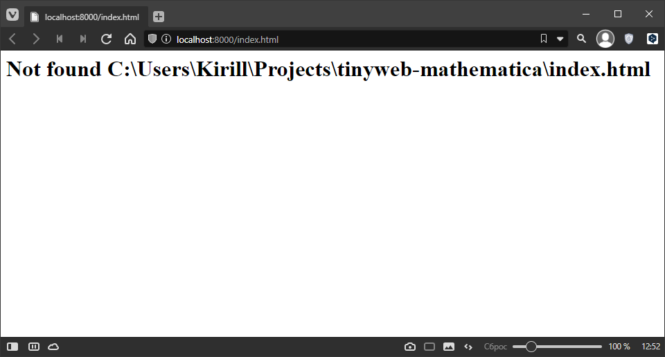
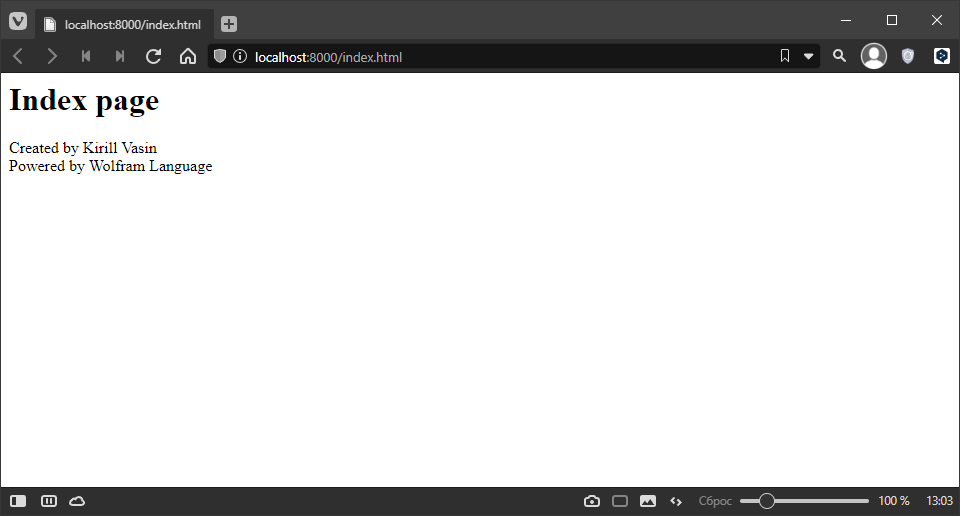
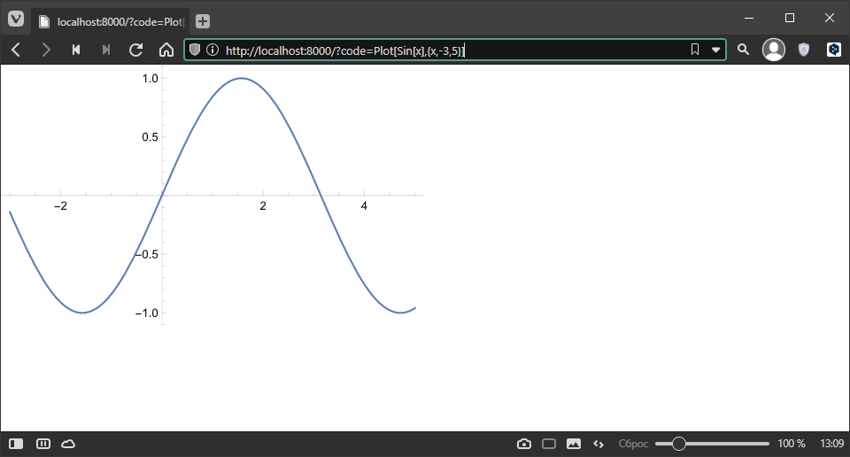
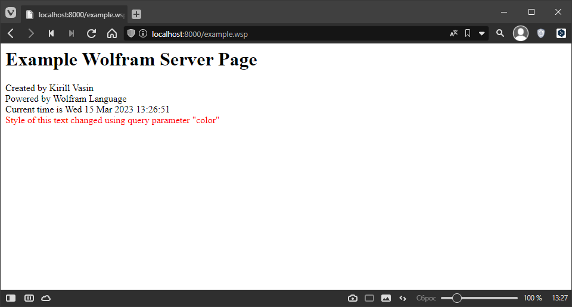

## The power of symbolic computation meets web design

# Tiny HTTP webserver

* HTTP and WebSocket server
* GET, POST methods
* caching
* single thread

# Wolfram Script Pages
>
> *hypertext preprocessor built on top of Wolfram Kernel*

Embed Mathematica code into HTML/CSS/JS. It works similar to PHP or Mustache template engine


```php
<?wsp Table[ ?> 
<?wsp Graphics3D[i[], ImageSize->Small] ?> 
<?wsp, {i, {Icosahedron, Octahedron, Tetrahedron}}] ?>
```

If you need to calculate something more complex, use Module, With, Block as usual. All variables can be global.

Built-in functions in a tiny JS framework allows to use the same syntax as in Mathematica. In the real demo text area is mirrored to all clients, and updates on every type using websockets.


```php
    <input id="webinput" type="textarea" value="Type something...">
    <script>
        const input = document.getElementById('webinput');
        input.addEventListener('input', updateValue);
        function updateValue(e) {
             socket.send(`UpdateInput["${input.value}"]`);
             console.log(`${input.value}`);
        };
        core.SetInput = function(args, env) {
            input.value = interpretate(args[0]);
        };
    </script>
```

On the Mathematica's side there is only one line

```mathematica
    UpdateInput[string_] := WebSocketBroadcast[server, SetInput[string], client]
```

# Usage

Import the recent packages

```mathematica
Import["https://raw.githubusercontent.com/JerryI/tinyweb-mathematica/master/Tinyweb/Tinyweb.wl"]
Import["https://raw.githubusercontent.com/JerryI/tinyweb-mathematica/master/WSP/WSP.wl"]
```

Create a folder in your notebook (or script) directory *public* for instance

```
--   yourproject.nb or yourscript.wls
--   public/
--   --   index.wsp
```

Then, put somehting in your *index.wsp*

```php
Hi! Your city is <?wsp CommonName /@ GeoNearest[Entity["City"], Here, 1] // First ?>
```

Run the command in the saved notebook to start the server locally

```mathematica
server = WEBServer["addr" -> "127.0.0.1:80",
"path" -> NotebookDirectory[] <> "public", "socket-close" -> True]

server // WEBServerStart
```

or inside the WolframScript

```mathematica
#!/usr/bin/env wolframscript

Import["https://raw.githubusercontent.com/JerryI/tinyweb-mathematica/master/Tinyweb/Tinyweb.wl"];
Import["https://raw.githubusercontent.com/JerryI/tinyweb-mathematica/master/WSP/WSP.wl"];

server = WEBServer["addr" -> "127.0.0.1:80", "path" -> "public", "socket-close" -> True];
server // WEBServerStart;
```

# Docs

The live version is /examples/demo/public

<https://jerryi.github.io/tinyweb-mathematica/>

# Refactored Version

The server version with a small refactoring is designed as a standard Wolfram Language
paclet.  

## Import the package

```mathematica
Get["JerryI`Tinyweb`"]
```

## Create empty TCP Server using HTTP

```mathematica
tcp = TCPServer[
    "CompleteHandler" -> <|"HTTP" -> HTTPQ -> HTTPLength|>, 
    "MessageHandler" -> <|"HTTP" -> HTTPQ -> http|>
]
```

Here the functions `TCPServer`, `HTTPQ` and `HTTPLength` are defined in the package
and the `http` variable is undefined.
It can be defined and changed after creating the server like this:

```mathematica
http = HTTPHandler["Pipeline" -> <|
    "Page" -> 
        AssocMatchQ[<|"Method" -> "GET", "Path" -> __ ~~ ".html"|>] -> 
            getPage, 
    "Evaluate" -> 
        AssocMatchQ[<|"Method" -> "GET", "Query" -> KeyExistsQ["code"]|>] -> 
            evaluateCode
|>]
```

Above `HTTPHandler` is a special type, which is something like a higher-order
function designed to handle requests. It is a mutable object that uses
property `Pipeline` to select a method and call it. Then we need to define the functions to execute the code and retrieve the page:  

```mathematica
getPage[request_Association] := 
Module[{fileName}, 
    fileName = FileNameJoin[Flatten[{Directory[], FileNameSplit[request["Path"]]}]]; 
    
    If[FileExistsQ[fileName] && Not[DirectoryQ[fileName]], 
        Import[fileName, "String"], 
    (*Else*)
        <|"Code" -> 404, "Body" -> "<h1>Not found " <> fileName <> "</h1>"|>
    ]
]
```

```mathematica
evaluateCode[request_Association] := 
Module[{result = ToExpression[request["Query", "code"]]}, 
    Switch[result, 
        _Graphics, ExportString[result, "SVG"], 
        _, ExportString[result, "String"]
    ]
]
```

And the last step is to start the server:  

```mathematica
SocketListen[8000, tcp[#]&]
```

Let's go to <http://localhost:8000/index.html>  

  

Now let's create an *index.html* file in the working directory and insert the following markup:  

```html
<html>
    <head>
    </head>
    <body>
        <h1>Index page</h1>
        Created by Kirill Vasin<br/>
        Powered by Wolfram Language
    </body>
</html>
```

Refresh the page in your browser:  

  

And let's try to call the second method, which is to execute the code.
To do this we go to the address <http://localhost:8000/?code=Plot[Sin[x],{x,-3,5}]>:  

  

Now let's try to change the logic of the server on the fly.
Let's create one more request handler:  

```mathematica
importWSP[request_Association] := 
Module[{fileName}, 
    fileName = FileNameJoin[Flatten[{Directory[], FileNameSplit[request["Path"]]}]]; 
    If[FileExistsQ[fileName] && Not[DirectoryQ[fileName]],
        StringTemplate[Import[fileName, "String"]][request["Query"]],
        <|"Code" -> 404, "Body" -> "<h1>Not found " <> fileName <> "</h1>"|>
    ]
]
```

And add it like this:  

```mathematica
http["Pipeline", "GETWSP"] = 
    AssocMatchQ[<|"Method" -> "GET", "Path" -> __ ~~ ".wsp"|>] -> 
        importWSP
```

Create an *example.wsp* file with the following markup:  

```html
<html>
    <head>
    </head>
    <body>
        <h1>Example Wolfram Server Page</h1>
        Created by Kirill Vasin<br/>
        Powered by Wolfram Language<br/> 
        Current time is <*Now*><br/> 
        <font color=`color`>Style of this text changed using query parameter "color"</font>
    </body>
</html>
```

Let's go to <http://localhost:8000/example.wsp?color=red>  

  
